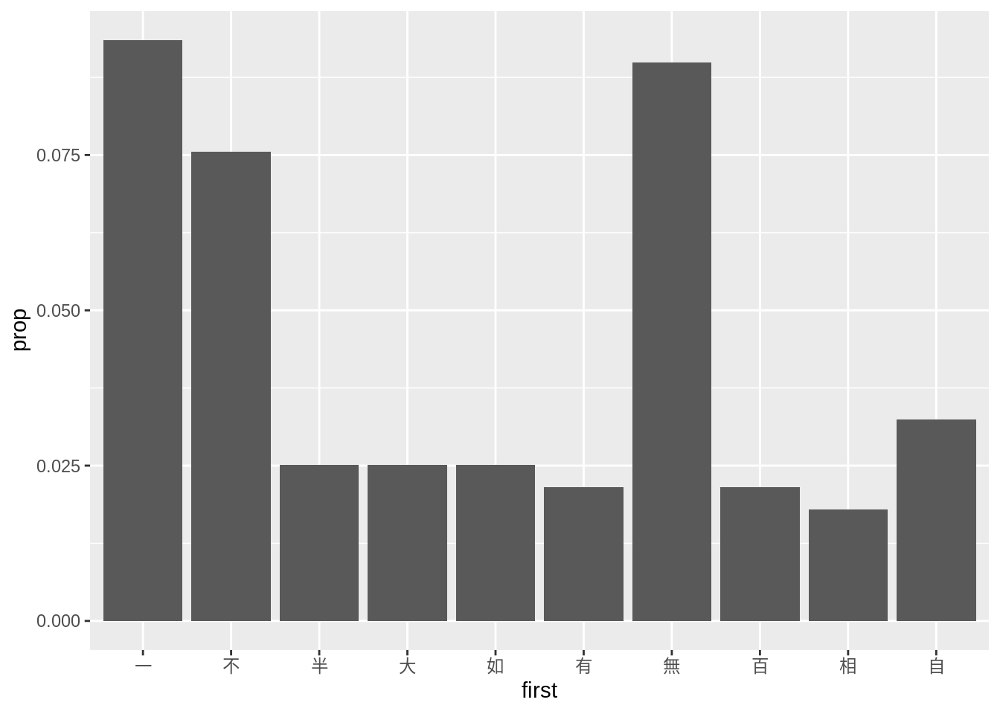

```{r setup, include=FALSE}
knitr::opts_chunk$set(echo = TRUE,comment = '#>',error=TRUE, results = 'hold', out.width='70%', fig.align = 'center', message = FALSE)
library(dplyr)
```

基本題 (共 100 分)
=====================

## RegEx (共 20 分)

請閱讀 `str_replace()` 的說明文件，並使用 `str_replace()` 與 RegEx 的 [group 與 backreference](https://rlads2019.github.io/lab/notes/08.html#backreference)，改變下列成語內部的順序，使結果符合要求：

```{r}
library(stringr)
idioms <- c("顛三倒四", "翻來覆去", "沸沸揚揚")
# 請勿更動上方程式碼

# Write your code here


# Should print out
#> [1] "倒四顛三" "覆去翻來" "揚揚沸沸"
```


## 成語結構 (共 80 分)

作業的 repo 中有一份純文字檔 `idioms.txt`。`idioms.txt` 是一個成語字典，裡面的每一行是一筆成語的資料，請先觀察這份純文字檔案的規律：

```r
【澡身浴德】	《禮記·儒行》：“儒有澡身而浴德。”孔穎達疏：“澡身，謂能澡潔其身不染濁也；浴德，謂沐浴於德以德自清也。”謂修養身心，使之高潔。
【枕麹藉糟】	枕著酒，墊著酒糟。謂嗜酒，醉酒。
【正本清源】	從根源上進行整頓清理。
【認雞作鳳】	佛教語。謂認凡庸為珍貴。
【擊轂摩肩】	形容車馬眾多。語出《戰國策·齊策一》：“臨淄之涂，車轂擊，人肩摩。”
【鳥覆危巢】	鳥巢因建於弱枝而傾覆。比喻處境極端危險。
【眼中有鐵】	比喻軍容整肅。語出《資治通鑒·陳世祖天嘉五年》：“春，正月，庚申朔，齊主登北城，軍容甚整。突厥咎周人曰：‘爾言齊亂，故來伐之：今齊人眼中亦有鐵，何可當耶！’”
...
```

1. (20 分) **擷取成語**  
請將 `idioms.txt` 讀進 R 成一個 character vector (每個元素皆為一筆成語, e.g. `【枕麹藉糟】	枕著酒，墊著酒糟。謂嗜酒，醉酒。`)，並取出位於 `【】` 之內的成語。我們僅需要 **4 字成語**，不在此範圍內的請將其濾掉。請將最後的結果儲存於變數 `idiom`：
    
    ```{r}
    # Write your code here

        
    ##### 請勿更動下方程式碼 #####
    head(idiom)
    length(idiom)
    sum(is.na(idiom))
    # Should print out:
    #> [1] "澡身浴德" "枕麹藉糟" "正本清源" "認雞作鳳" "擊轂摩肩" "鳥覆危巢"
    #> [1] 9697
    #> [1] 0
    ```

<div class="alert alert-success hint">
1. 你應該會使用到 `readLines()` 以將 `idioms.txt` 讀入
2. 你應該會使用到 `str_match()` 以取出 `【】` 內的成語
</div>


2. (15 分) **成語分類器**  
在成語裡面往往可以看到一些語言中的規律。
你的任務是完成下方的 `classify()`，這個函數可以將輸入的成語 (character vector)，依據其內部結構，分成 4 種類別：
    - `AABB`: 例如，`"坦坦蕩蕩"`, `"吞吞吐吐"`
    - `ABAC` : 例如，`"滿坑滿谷"`, `"不屈不撓"`
    - `ABCB` : 例如，`"載舟覆舟"`, `"屨及劍及"`
    - `ABCA` : 例如，`"精益求精 "`, `"忍無可忍"`
    - `NA`: 若不屬於上述結構，則需輸出 `NA`

    ```{r}
    classify <- function(idiom) {
      # Write your code here
    }
    
    
    ##### 請勿更動下方程式碼 #####
    idioms <- c("念茲在茲", "騰雲駕霧", "清清白白", "一五一十", "防不勝防")
    classify(idioms)
    # Should print out:
    #> [1] "ABCB" NA   "AABB" "ABAC" "ABCA"
    ```

3. (25 分) **建立 data frame**  
請使用 `classify()` 與以前所學過的東西，將儲存在 `idiom` 中的成語變成一個 data frame 並將其儲存於變數 `df` 。這個 data frame 必須具有 6 個變項 (資料類型皆為 `character`)：
    - `idiom`: 本來儲存於變數 `idiom` 中的成語
    - `class`: 依據成語內部結構的分類結果
    - `first`: 該成語的第一個字
    - `second`: 該成語的第二個字
    - `third`: 該成語的第三個字
    - `fourth`: 該成語的第四個字

    ```{r}
    # Write your code here
    
    
    ##### 請勿更動下方程式碼 #####
    df %>% filter(class == "ABCA") %>% arrange(desc(idiom)) %>% head(8)
    # Should print out:
    #> # A tibble: 8 x 6
    #>   idiom    class first second third fourth
    #>   <chr>    <chr> <chr> <chr>  <chr> <chr> 
    #> 1 防不勝防 ABCA  防    不     勝    防    
    #> 2 訛以傳訛 ABCA  訛    以     傳    訛    
    #> 3 親上成親 ABCA  親    上     成    親    
    #> 4 衣錦褧衣 ABCA  衣    錦     褧    衣    
    #> 5 聞所未聞 ABCA  聞    所     未    聞    
    #> 6 美益求美 ABCA  美    益     求    美    
    #> 7 精益求精 ABCA  精    益     求    精    
    #> 8 節中長節 ABCA  節    中     長    節
    ```

3. (20 分) **視覺化**  
我想要知道結構是 `ABAC` (e.g., `一五一十`) 的這類成語中，最常出現在第一個字的位置的字為何。請使用 `dplyr` (或其它套件) 以及 `ggplot2` 幫我**透過圖片**呈現出這些字的頻率或比例  (請找出頻率或比例最高的前十個字)，例如，你可以繪製出下面這張圖：
{.half}


    ```{r}
    # Write your code here
    
    # 請務必印出圖片
    ```


進階題 (共 20 分)
=====================

1. (5分) **身分證字號**  
從`id_data`中，找出身分證字號開頭為高雄市(E)或新北市(F)的港澳男生(第二碼為1)。

>第3碼依內政部92年4月24日台內戶字第0920063929號函規定，自92年7月開始，有關在台無戶籍之外籍、港澳、大陸地區人民及無戶籍國民申請定居時，另行配賦國民身分證統一編號，並以第三碼「6、7、8、9」為區別碼，其區別標準如下：  
 1、 載有「取得國籍日期」者，配賦代碼「6」。  
 2、 載有「海外僑民」者，配賦代碼「7」。  
 3、 載有「港澳居民」者，配賦代碼「8」。  
 4、 載有「大陸地區人民」者，配賦代碼「9」。  

2. (5分) **email**  
從 `email_data` 中，找出結尾非 `address` 的信箱。

3. (5分) **圖檔**  
從 `file_data` 中，找出有編號的圖檔（副檔名為 `.png`, `.jpg` 或 `.jpeg`）。

4. (5分) **url**  
從 `url_data` 中，找出 url 的網域，也就是去除最開頭的通訊協定方式，以及結尾的埠，例如：`https://localhost:3000/` 會找到 `localhost`，其中的 `https` 是通訊協定方式，而 `3000` 是埠。

<div class="alert alert-success hint">
以上三小題，因為 `id_data` , `email_data`, `file_data`, `url_data` 都是黏在一起字串，在抓取符合規則的結果前，可以先使用 `strsplit` 將字串切分成 list，再尋找規則。
</div>

```{r}
# 請勿更動此 code chunk 程式碼
id_data <- 
"A121040176
L186856359
F177598010
I174537095
D279884447
E176834359
F178075085
186834359E
D243736345
I114537095
K979075085
F146110887
13127890AF
D187217314
I114537095
E293556025
243556025E
Z177598010
H250077453
Q188367037"

email_data <- "
first_example@yahoo.com.tw
unique@gmail.com
rlads2019@ntu.edu.tw
very.common.address@example.com
a.little.lengthy.but.ok@dept.example.com
not_good@email.address"

file_data <- "
.bash_profile
workShop.ai
file_folderName_num.jpg
favicon.png
IMG_002.png
IMG_003.jpeg
IMG_004.jpg
002.jpg.tmp
index.html
foobar.bmp
foobar.jpg
account.html
access.lock"

url_data <- "ftp://file_server.com:21/account/customers.xml
https://www.r-bloggers.com/
file://localhost:3000
https://s3cur3-server.com:9999/"
```

```{r}
# Write your code here
```


```
should print out:
[1] "F177598010" "E176834359" "F178075085"

[1] "first_example@yahoo.com.tw"              
[2] "unique@gmail.com"                        
[3] "rlads2019@ntu.edu.tw"                    
[4] "very.common.address@example.com"         
[5] "a.little.lengthy.but.ok@dept.example.com"

[1] "IMG_002.png"  "IMG_003.jpeg" "IMG_004.jpg"

[1] "file_server.com"             "https://www.r-bloggers.com/"
[3] "localhost"                   "s3cur3-server.com"
```